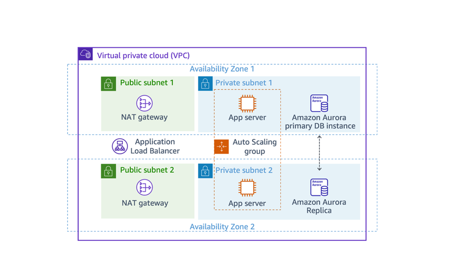
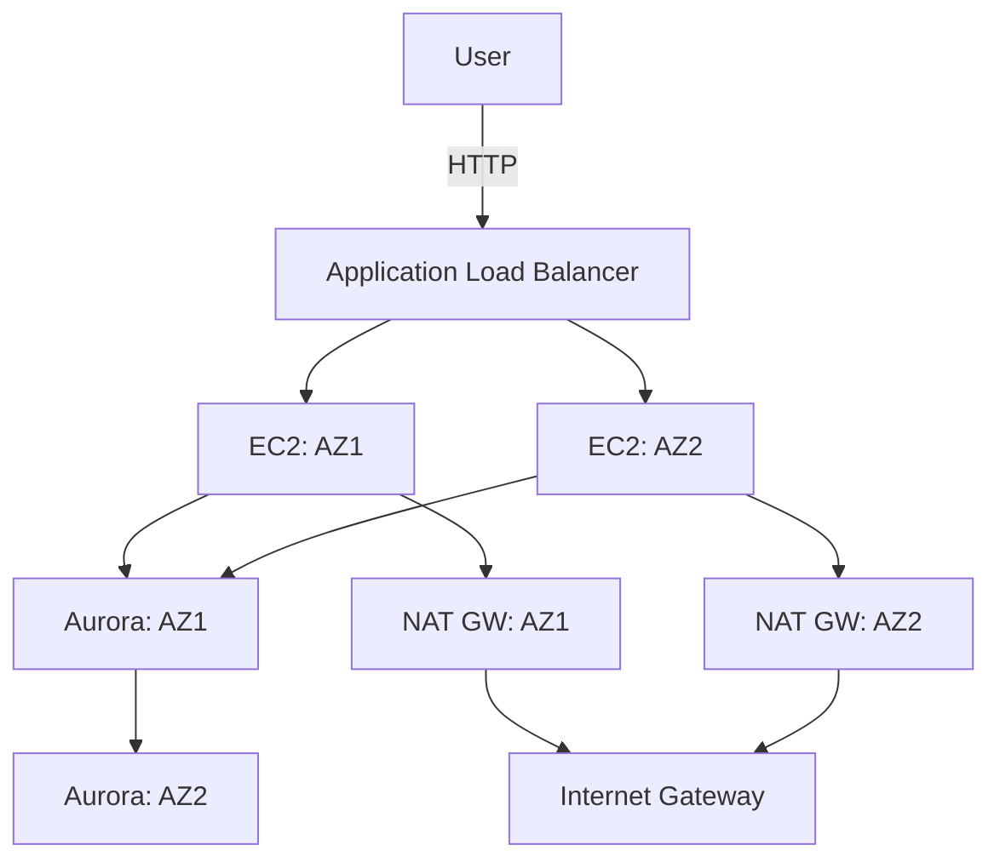
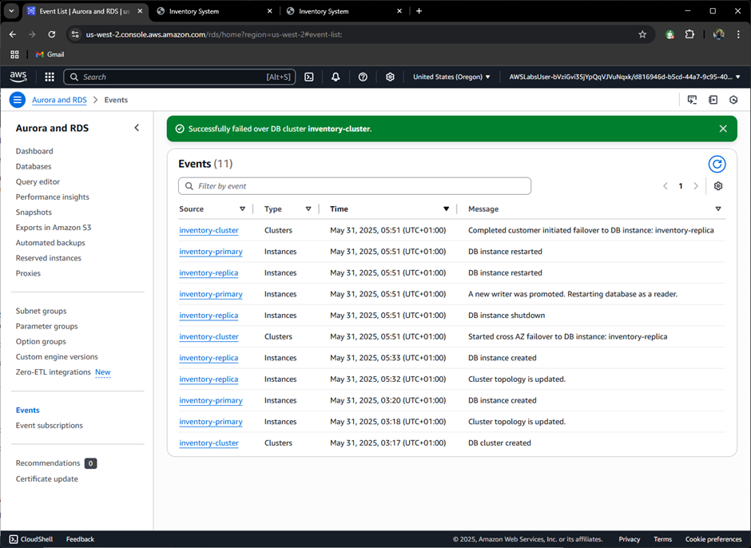
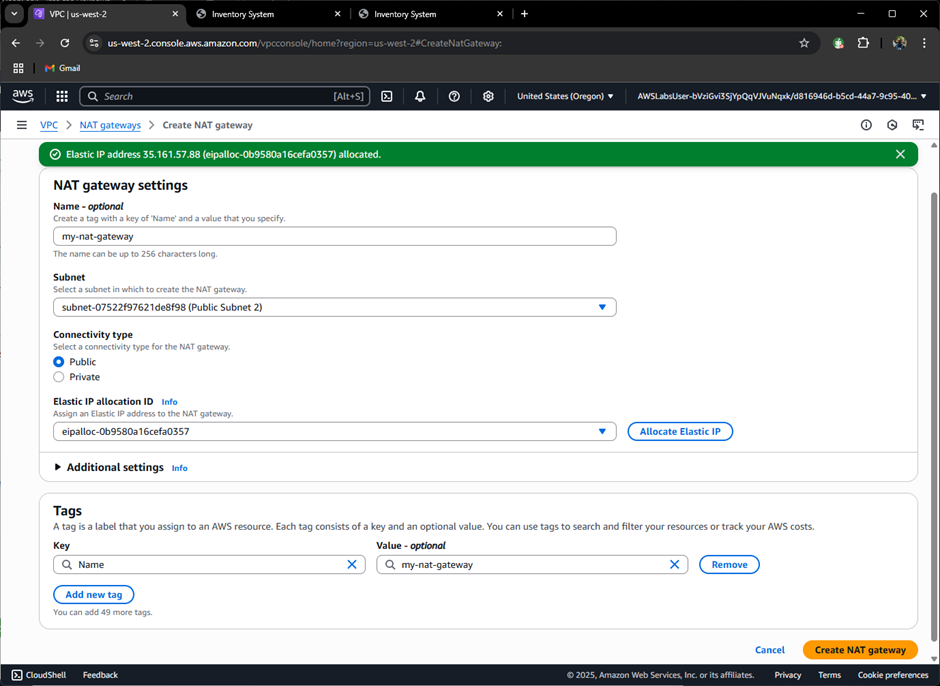
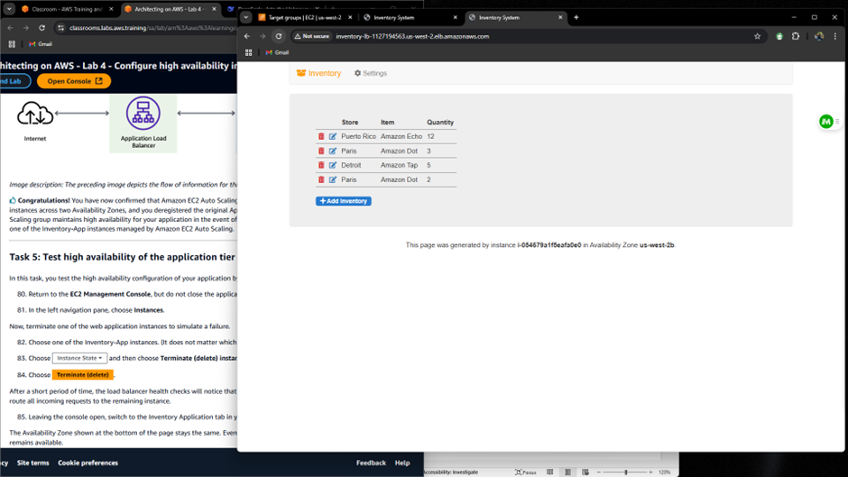

# AWS High Availability Lab

## 📝 Lab Overview

**Objective**: Configure a highly available infrastructure in AWS spanning multiple Availability Zones.



## 🎯 Key Achievements

- ✔️ Deployed EC2 Auto Scaling group across 2 AZs
- ✔️ Configured Aurora DB with cross-AZ replica
- ✔️ Implemented redundant NAT gateways
- ✔️ Validated automatic failover capabilities

## 🌐 Architecture Components



## 🛠️ Implementation Details

### 1. Auto Scaling Setup

**Launch Template Configuration**:

```bash
# User data script for web server
#!/bin/bash
yum update -y
yum install -y httpd php mysql
systemctl start httpd
chkconfig httpd on
```

**Auto Scaling Group**:

- **Min/Max Capacity**: 2 instances
- **Health Check**: ELB (HTTP:80/)
- **Subnets**: Private subnets in us-east-1a & us-east-1b


### 2. Aurora DB High Availability

**Configuration**:

- Primary: us-east-1a
- Replica: us-east-1b
- Failover tested via console

**Failover Process**:

1. Initiate failover from RDS console
2. Aurora promotes replica to primary (<30s)
3. Application reconnects automatically



### 3. NAT Gateway Redundancy

| Component         | AZ1          | AZ2          |
| ----------------- | ------------ | ------------ |
| **Public Subnet** | 10.0.0.0/24  | 10.0.1.0/24  |
| **NAT Gateway**   | nat-gw-1     | nat-gw-2     |
| **Elastic IP**    | eipalloc-123 | eipalloc-456 |



## 🧪 Validation Tests

### Application Tier

1. Accessed application via ALB DNS:
   ```
   http://inventory-lb-1234567890.elb.amazonaws.com
   ```
2. Terminated instance → Verified auto-recovery



### Database Tier

- Forced failover → Measured downtime
- Verified data consistency post-failover

## 💡 Lessons Learned

1. **Auto Scaling Best Practices**:

   - Always configure health checks
   - Use multiple AZs for true redundancy

2. **Aurora Insights**:

   - Failover is automatic but causes brief interruption
   - Reader endpoint remains available during failover

3. **Cost Considerations**:
   - NAT gateways cost $0.045/hour each
   - Consider NAT instances for dev environments

## 🚀 Next Steps

- [ ] Implement Route 53 health checks
- [ ] Configure VPC Flow Logs
- [ ] Test cross-region replication

## 📚 References

- [AWS Auto Scaling Docs](https://docs.aws.amazon.com/autoscaling/)
- [Aurora High Availability](https://docs.aws.amazon.com/AmazonRDS/latest/AuroraUserGuide/Concepts.AuroraHighAvailability.html)

---

**Lab Completion Time**: 2.5 hours  
**AWS Services Used**: EC2, ALB, RDS Aurora, VPC, NAT Gateway  
**Difficulty Level**: Intermediate

```

```
