# 🛡️ Bastion Host Project Setup

## Overview

In enterprise environments, networks are often segmented to enforce **separation of concerns** and achieve **fault isolation**.  
In this project, I replicated a similar setup on **AWS** by implementing a **Bastion Host architecture**.

The Bastion Host serves as a secure entry point into a private network, controlling access to instances that are not directly exposed to the internet.

---

## 🧩 Project Description

I created two EC2 instances:

- **Bastion Host (Public Subnet):** Configured to receive traffic from the internet.
- **Private Host (Private Subnet):** Accessible **only through** the Bastion Host.

This architecture ensures that only the Bastion can reach the private instance — providing a secure, controlled access path.

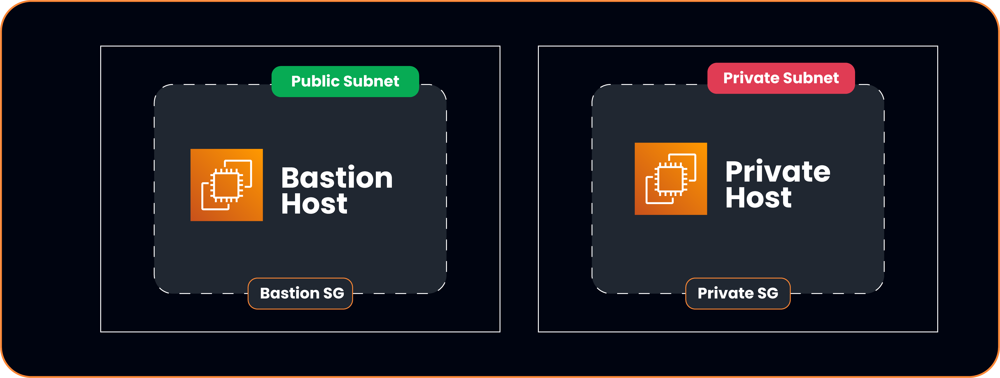

---

## ⚙️ AWS Services Used

- **Amazon VPC**
- **EC2**
- **AMI (Amazon Machine Image)**
- **Security Groups**

---

## 🪜 Step-by-Step Walkthrough

### Step 1: Create a VPC

Created a custom VPC with CIDR block `10.0.0.0/16`.


---

### Step 2: Create Subnets

- **Public Subnet:** `10.0.1.0/24`  
  Enabled _auto-assign public IP_ for internet access.
- **Private Subnet:** `10.0.2.0/24`  
  Left _auto-assign public IP_ disabled (default).

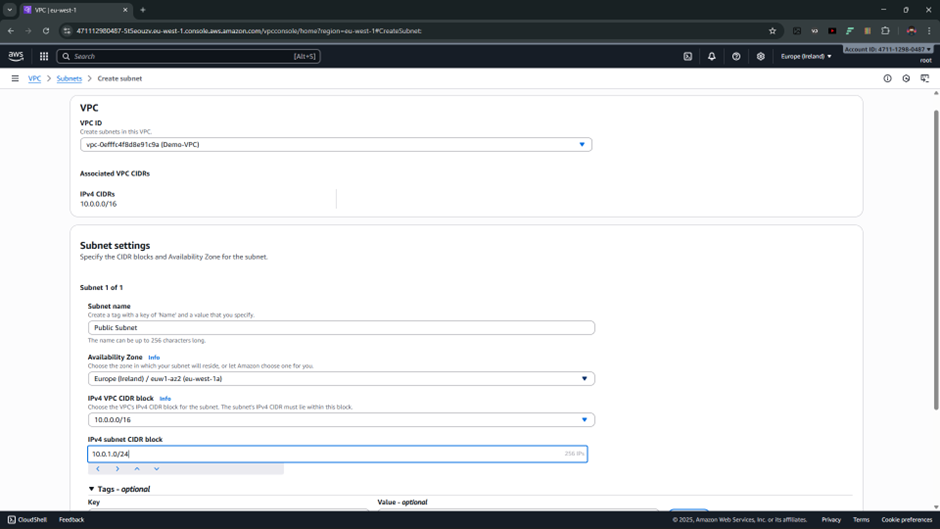
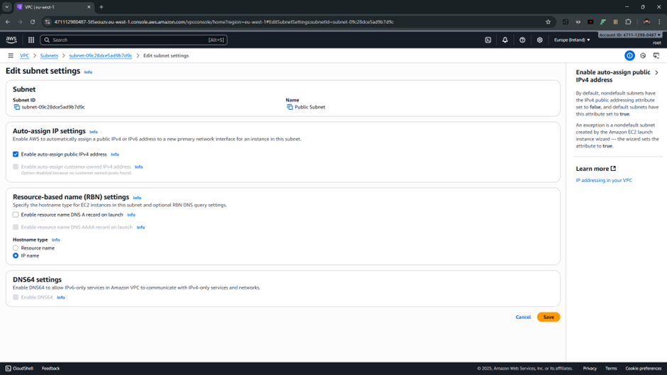

---

### Step 3: Create an Internet Gateway (IGW)

Attached the IGW to the VPC to enable internet connectivity for the public subnet.
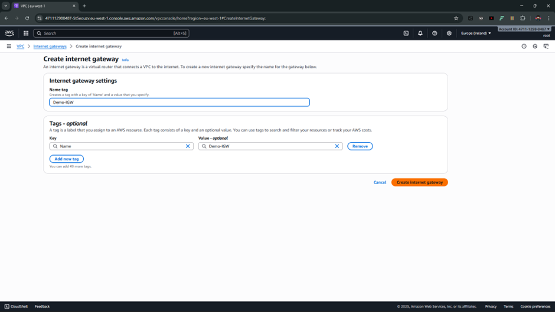

---

### Step 4: Configure Route Tables

- **Public Route Table:**  
   Added route `0.0.0.0/0` → Internet Gateway (IGW).  
   Associated this table with the **Public Subnet**.
  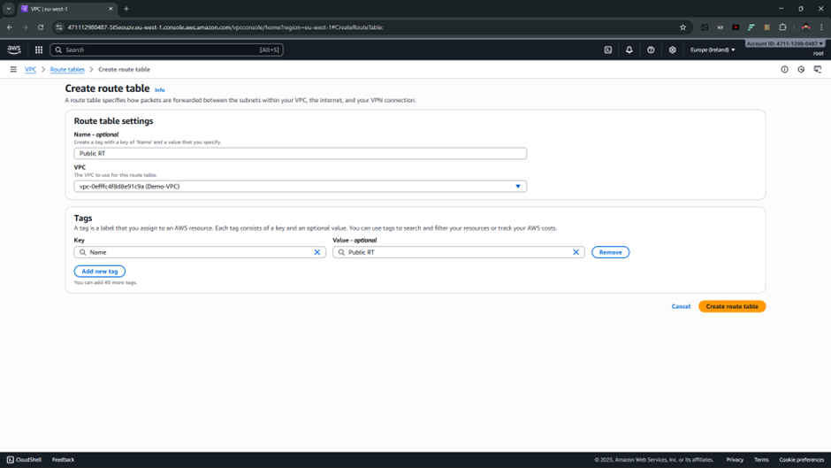
- **Private Route Table (default):**  
  Retained only the `local` route for internal communication within the VPC.

> 💡 Lesson learned: After creating the IGW, it must be **attached** to the VPC before it appears as a route target.
> 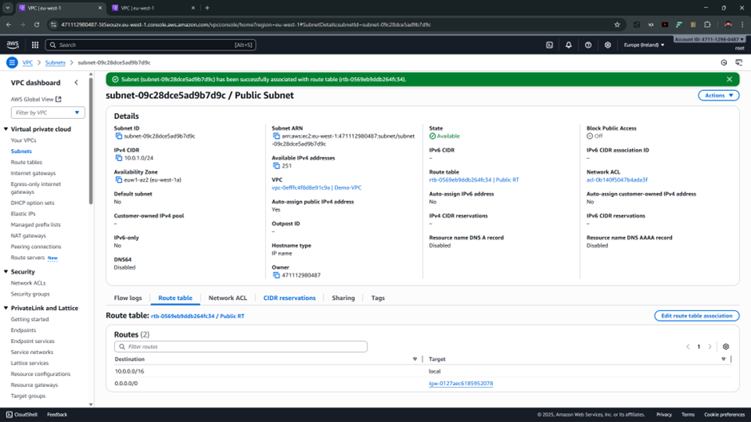

---

### Step 5: Set Up Security Groups

#### Bastion Security Group

- **Inbound:** SSH (TCP 22) from _my IP address only_
- **Outbound:** All traffic (0.0.0.0/0)
  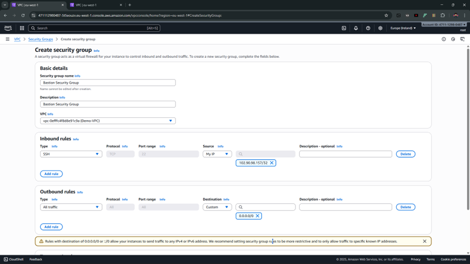

#### Private Instance Security Group

- **Inbound:** SSH (TCP 22) only from the **Bastion Security Group**
- **Outbound:** All traffic (default)
  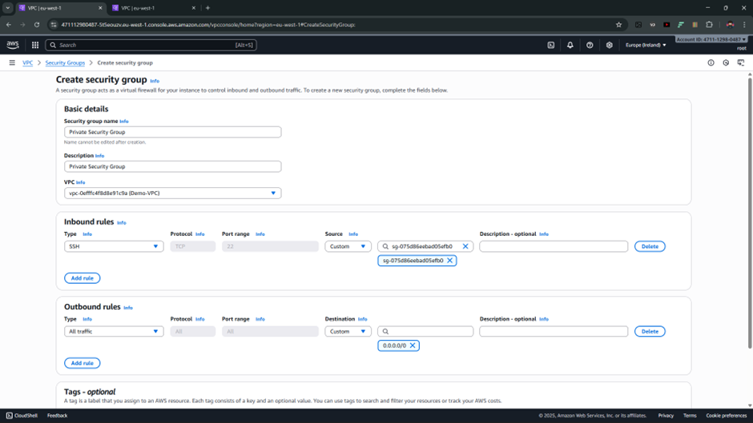

---

### Step 6: Create Key Pairs

Created SSH key pairs using **RSA encryption**, following best practices in cryptography.

> First time working with SSH keys this way — hands-on knowledge meets classroom theory. 😄
> 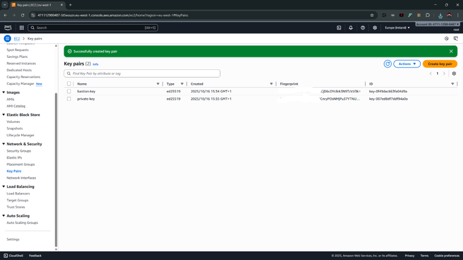

## 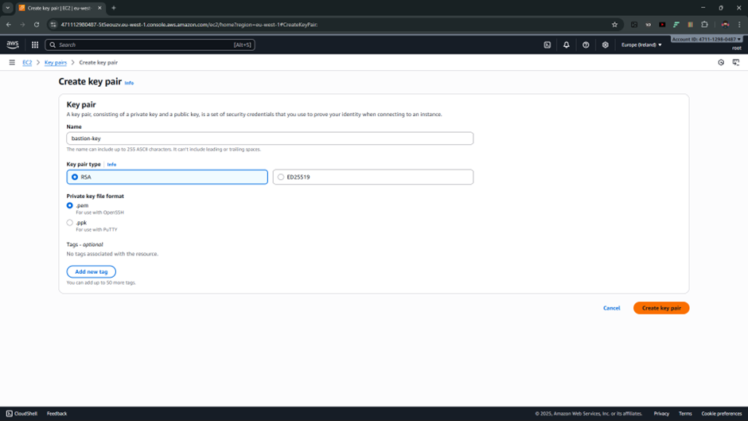

### Step 7: Launch EC2 Instances

#### Bastion Host

Launched an EC2 instance in the **public subnet** using the created key pair.
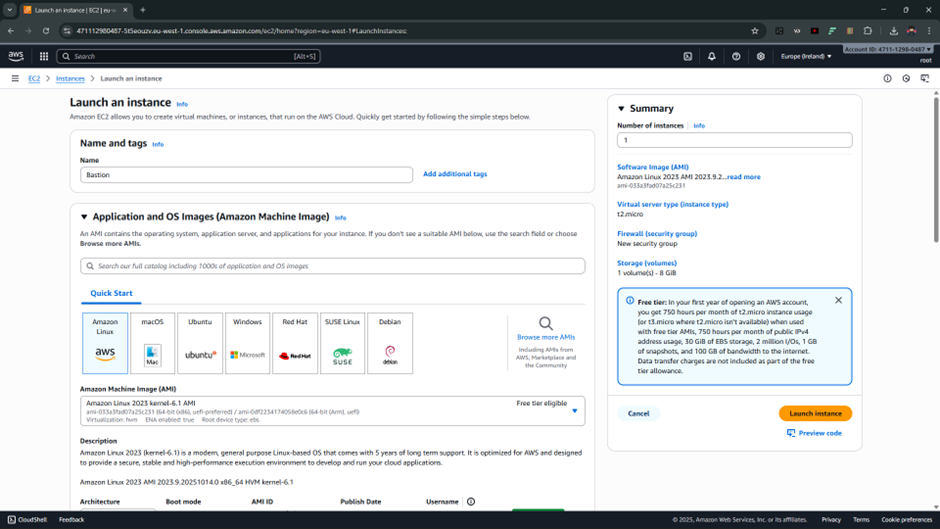

#### Private Instance

Launched another EC2 instance in the **private subnet** with **no public IP**.  
This instance will only be reachable through the Bastion host.

---

### Step 8: (Bonus) Using AMIs

Initially, I mistakenly launched the Bastion instance in the **default VPC** instead of my custom one.  
Instead of terminating it immediately, I experimented with **Amazon Machine Images (AMI)**:

- Created an AMI from the existing instance.
  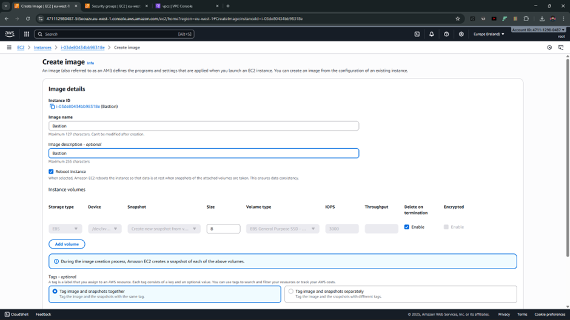
- Relaunched a new instance in the correct VPC using that AMI.
  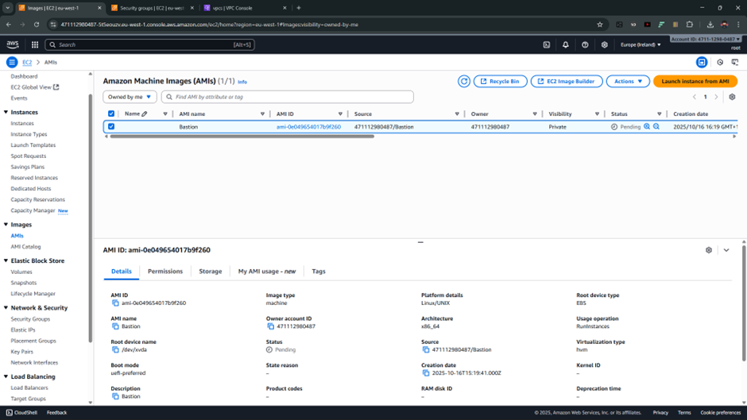
  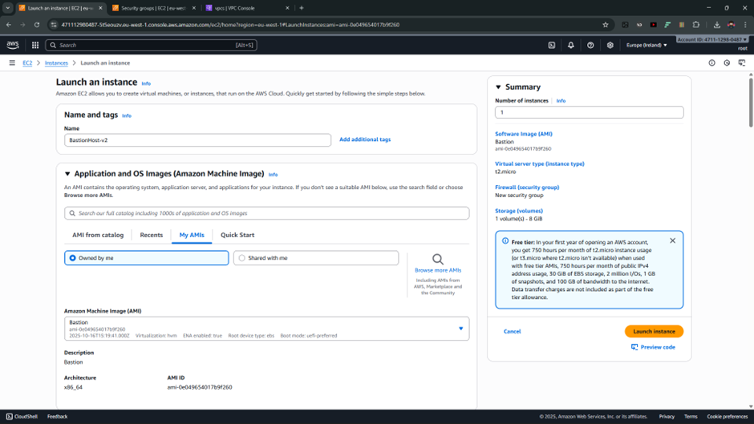
  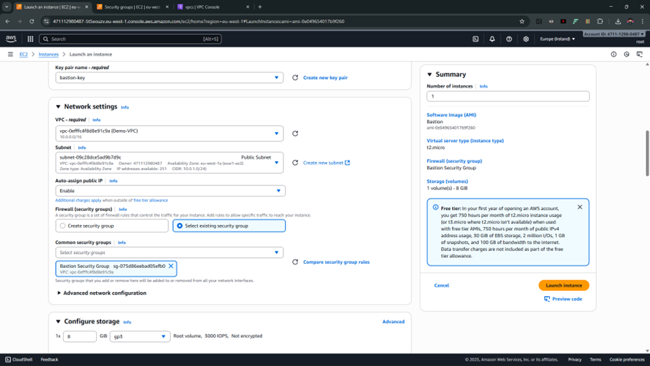
- Terminated the old instance — **cost optimization at its finest.**
  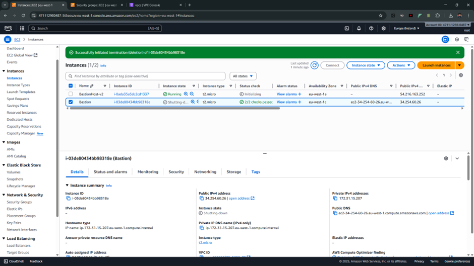

---

### Step 9: Connect via SSH

Connected to the Bastion Host using my `.pem` key:

```bash
ssh -i bastion-key.pem ec2-user@<BastionPublicIP>
```


### Step 10: Transfer the private key to the Bastion (SCP)

Securely copy the private key to the Bastion host from your local machine:

```bash
scp -i bastion-key.pem private-key.pem ec2-user@<BastionPublicIP>:/home/ec2-user/
```

On the Bastion host, restrict permissions on the private key before use:

```bash
chmod 600 /home/ec2-user/private-key.pem
```

### Step 11: SSH from the Bastion to the Private Instance

From the Bastion, connect to the private instance using its private IP:

```bash
ssh -i /home/ec2-user/private-key.pem ec2-user@<PrivateInstancePrivateIP>
```


✅ Result

- Successful login — the private instance is accessible only through the Bastion host.
- Here, I tried logging into the private EC2 instance from my local machine and the connection timed out, as planned.🌚🙃

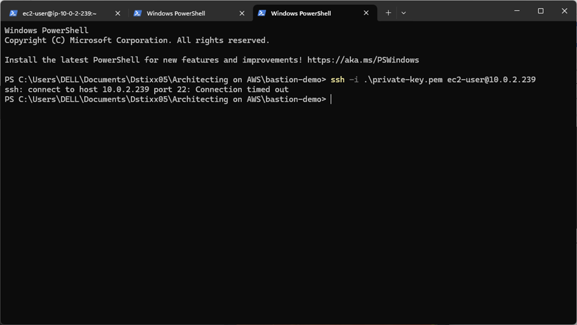

### 🧠 Lessons Learned

- VPC isolation and proper subnet configuration are essential for secure architectures.
- IAM roles/policies and Security Groups enforce least-privilege access and must be carefully configured.
- AMIs simplify redeployment when instances are launched in the wrong VPC.
- Hands-on SSH key management and basic Linux administration are critical operational skills.

### 🏁 Conclusion

This exercise reinforced cloud security and networking concepts by implementing a Bastion Host pattern that controls administrative access to private resources while maintaining a minimal attack surface.
