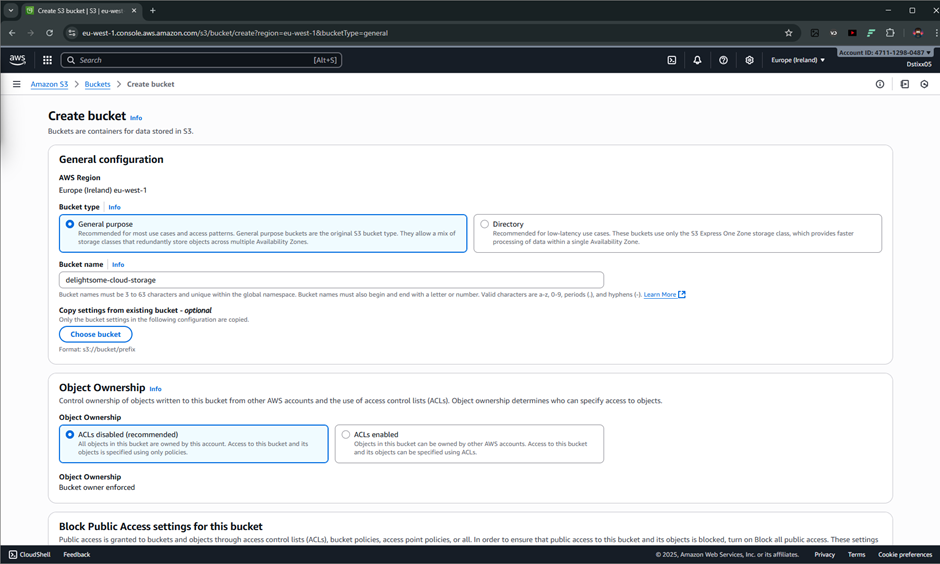
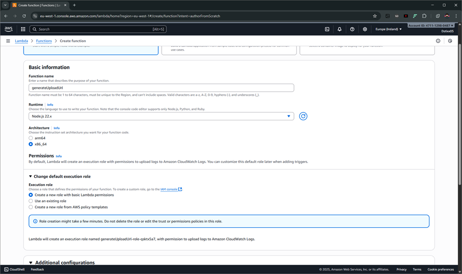
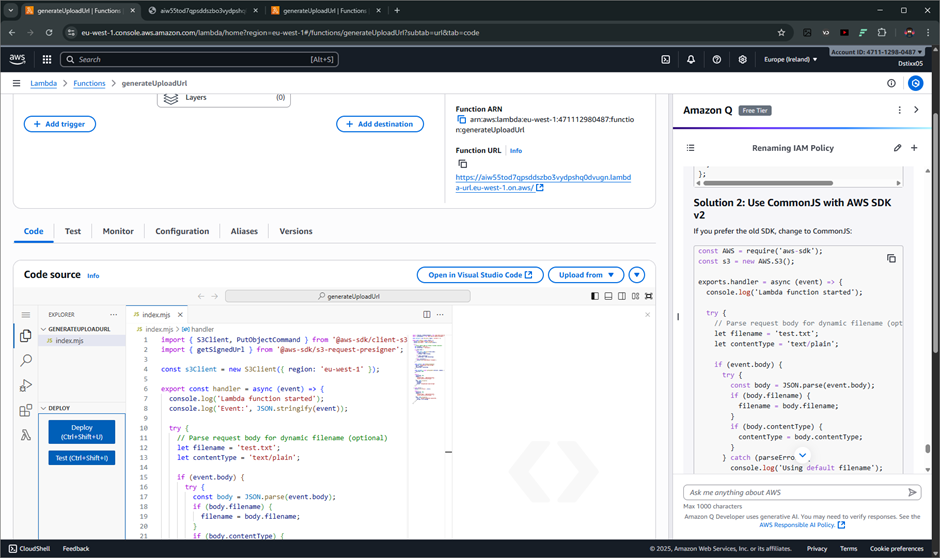
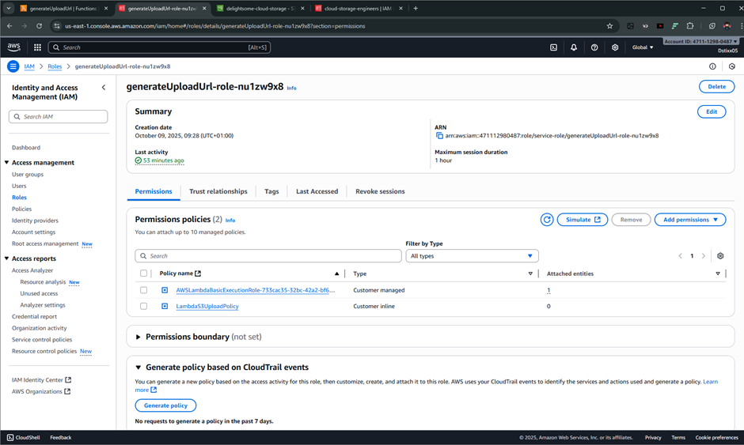
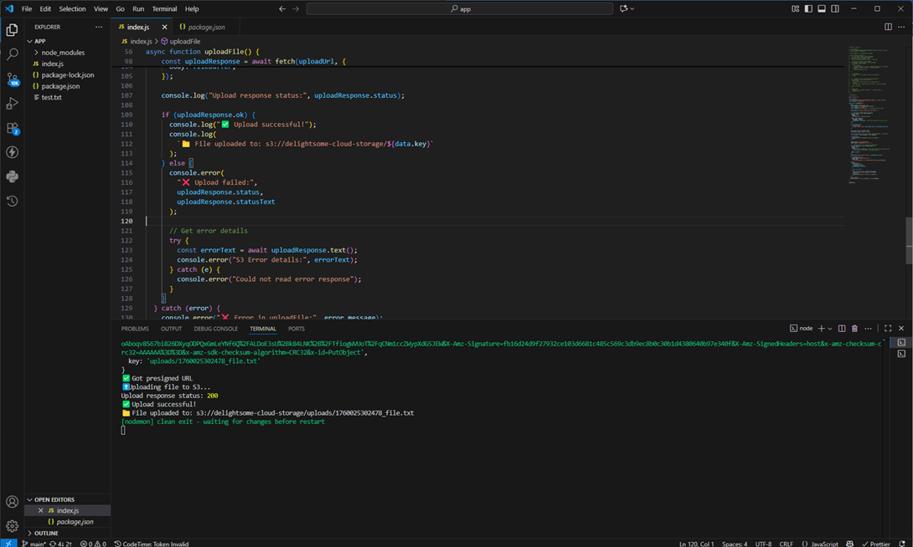
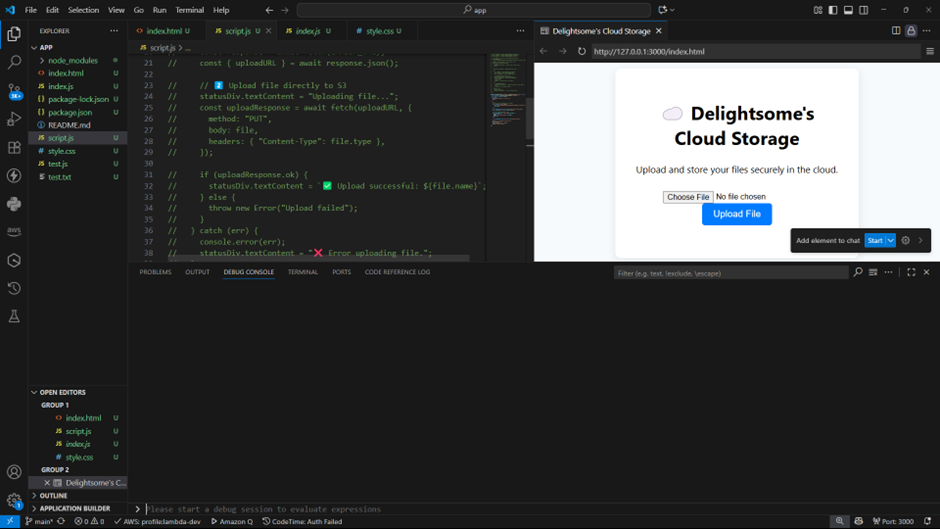
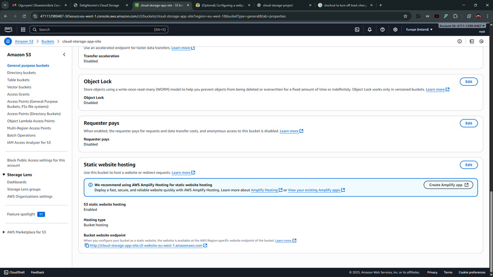

# ☁️ Cloud Native Storage App on AWS

A serverless storage application built using **AWS Lambda**, **S3**, and **Vanilla JavaScript**.  
This project demonstrates how to design and deploy a lightweight, scalable, and cost-efficient file storage system entirely on AWS.

### 1. Setting Up the S3 Bucket

Since I’m based in Nigeria, I chose the `eu-west-1 (Ireland)` region for better proximity.  
Other key factors I considered when choosing a region include:

- **Data residency**
- **Available services**
- **Budget**


For testing, I temporarily **disabled “Block Public Access”** on the bucket.

---

### 2. IAM User and Permissions

Following the **principle of least privilege**, I created an IAM group and added a user `cloud-storage-engineers` to it.

Attached permissions:

- `AmazonS3FullAccess`
- `AWSLambdaFullAccess`
- `CloudWatchLogsFullAccess`




This allowed access to S3, Lambda, API Gateway, and CloudWatch logs (for debugging).

---

### 3. Lambda Function — Generating Pre-signed URLs

I created a Lambda function using **Node.js**, which generates a **pre-signed URL** to upload files directly to S3.

**Key steps:**

- Created an **execution role** for Lambda.
- Exposed the function via a **Function URL**.
- Added an **inline policy** to grant S3 write permissions.






---

### 4. Testing with Node.js



To test, I set up a small Node.js script that uploads files to the S3 bucket using the generated pre-signed link.

---

### 5. Building the Frontend (Client Application)

I built a simple **Vanilla JS frontend** to upload files through the Lambda endpoint.  
After configuring **CORS** properly, it worked smoothly in local development.

I planned to host with **AWS Amplify**, but due to credit restrictions, I went with **S3 Static Website Hosting** instead — which worked perfectly for a static app.


---

### 6. Hosting on S3

To host, I created another S3 bucket for the website.
check it out [here](http://cloud-storage-app-site.s3-website-eu-west-1.amazonaws.com/)

**Steps:**

1. Disabled _Block all public access_ (to make the site public).
2. Applied a public-read bucket policy:

   ```json
   {
     "Version": "2012-10-17",
     "Statement": [
       {
         "Sid": "PublicReadGetObject",
         "Effect": "Allow",
         "Principal": "*",
         "Action": "s3:GetObject",
         "Resource": "arn:aws:s3:::your-bucket-name/*"
       }
     ]
   }
   ```


