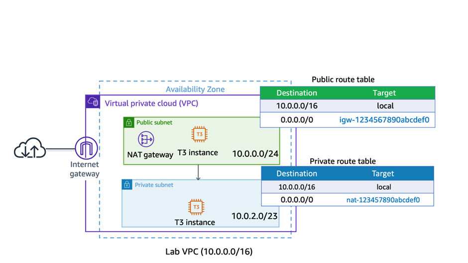
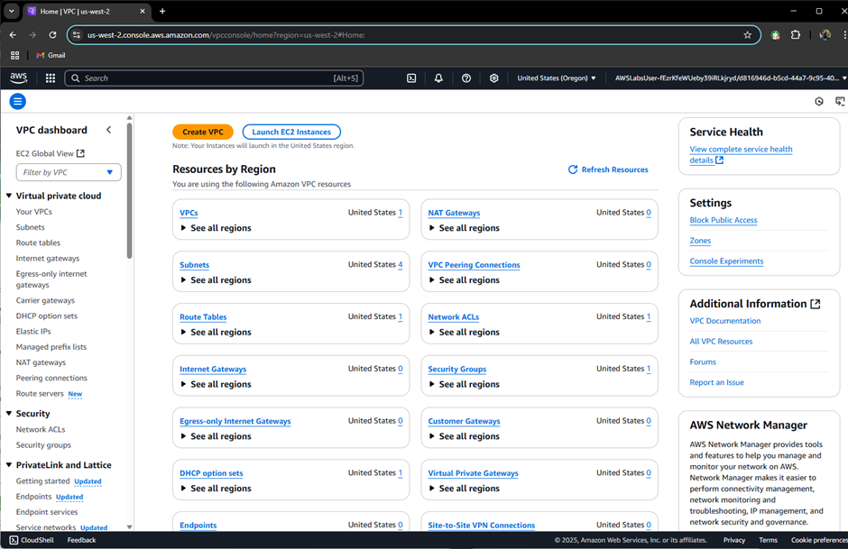
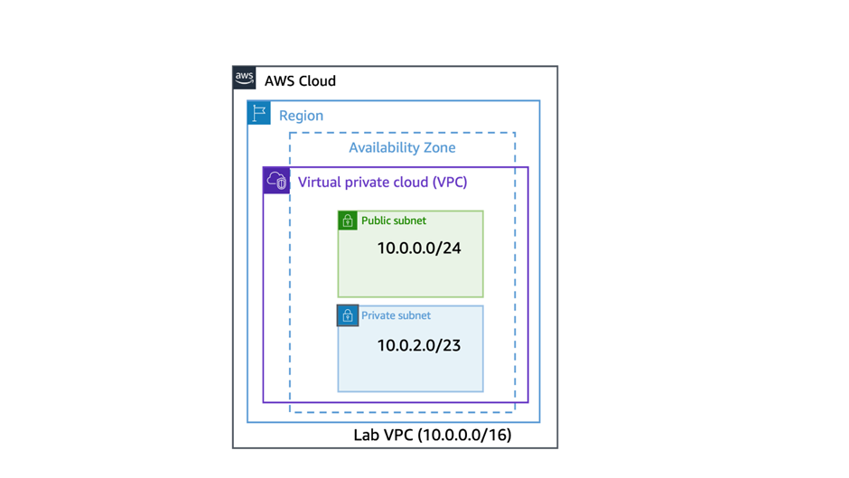
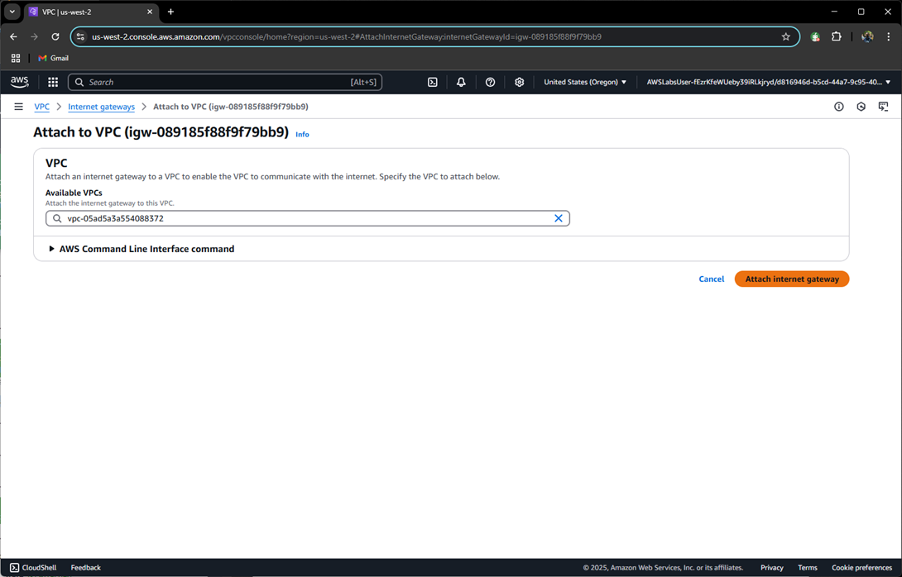
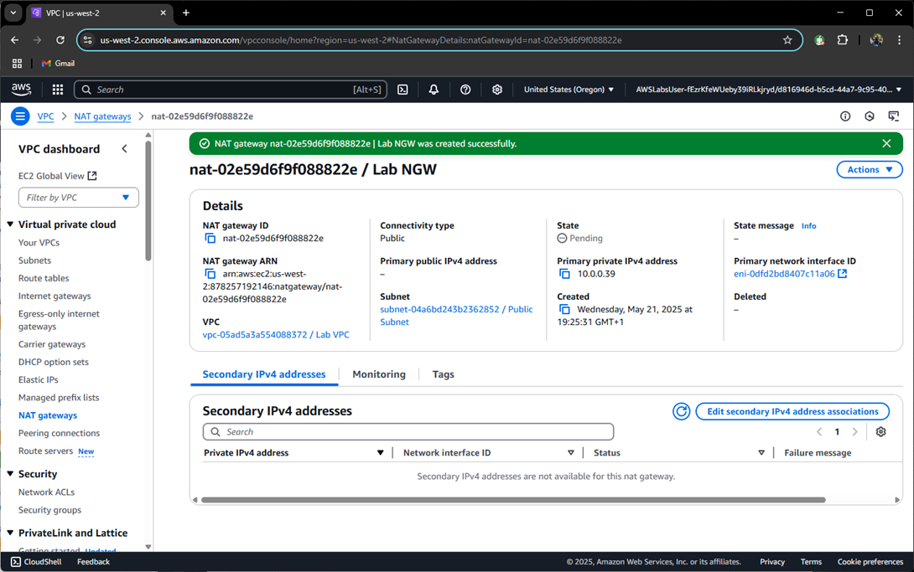
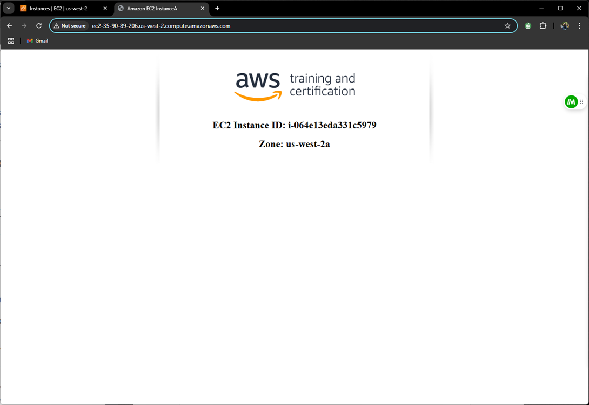
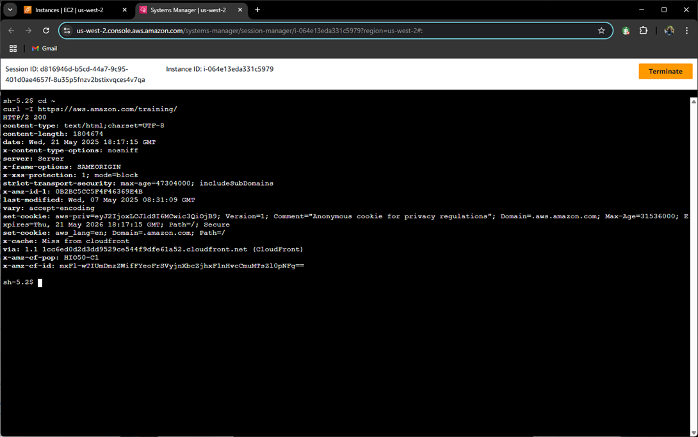
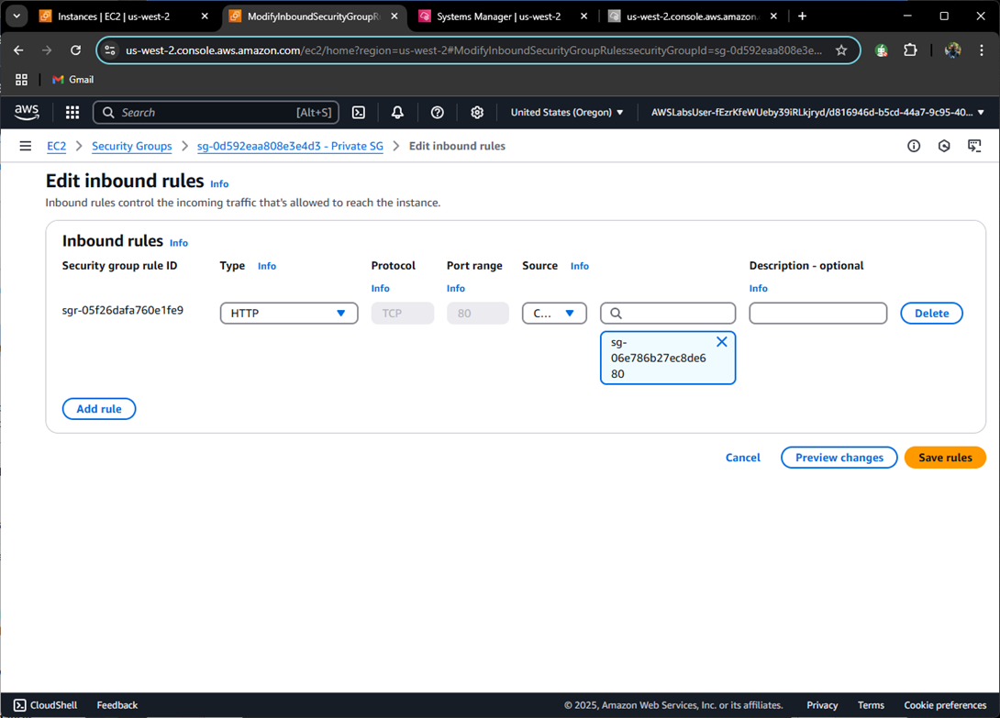

# AWS Solutions Architect Lab: VPC Infrastructure Design

## 🌐 Lab Overview

**Objective**: Build a secure VPC with public/private subnets, NAT Gateway, and EC2 instances to demonstrate AWS networking fundamentals.

### 📋 Key Tasks Completed

1. Created a VPC with `10.0.0.0/16` CIDR
2. Configured public & private subnets
3. Implemented Internet Gateway (IGW) and NAT Gateway
4. Launched EC2 instances in both subnets
5. Established connectivity via Security Groups and Session Manager

---

## 🛠️ Architecture Components



### Core AWS Services Used:

| Service             | Purpose                              |
| ------------------- | ------------------------------------ |
| **VPC**             | Network isolation (10.0.0.0/16)      |
| **EC2**             | Public web server + Private instance |
| **NAT Gateway**     | Outbound internet for private subnet |
| **Security Groups** | Controlled access to instances       |

---

## 🔧 Step-by-Step Implementation

### 1. VPC Creation

- CIDR: `10.0.0.0/16`
- Enabled DNS hostnames
  

### 2. Subnet Configuration

| Subnet Type | CIDR Block  | Auto-assign IP | Use Case             |
| ----------- | ----------- | -------------- | -------------------- |
| **Public**  | 10.0.0.0/24 | ✅ Yes         | Web-facing resources |
| **Private** | 10.0.2.0/23 | ❌ No          | Isolated backend     |



### 3. Internet Gateway (IGW)

- Attached to VPC
- Route table directs public subnet traffic to IGW
  

### 4. NAT Gateway

- Placed in **public subnet** with Elastic IP
- Private subnet route table points to NAT
  

### 5. Security Groups

| Group          | Rules               | Purpose           |
| -------------- | ------------------- | ----------------- |
| **Public SG**  | HTTP (80), SSH (22) | Web server access |
| **Private SG** | HTTP from Public SG | Internal comms    |

---

## 🧪 Connectivity Tests

1. **Public Instance**:

   - Accessed via HTTP: `http://<public-IP>`
     

2. **Private Instance**:

   - Connected via Session Manager
   - Verified outbound internet: `curl -I https://aws.amazon.com`
     

3. **Cross-Subnet Test**:
   - Public instance accessed private instance:
     ```bash
     curl 10.0.3.101  # Successful response
     ```
     

---

## 💡 Key Learnings

1. **Subnet Strategy**: Public vs. private routing
2. **NAT Gateway**: Enables private subnet internet access without exposing instances
3. **Security Groups**: Stateful filtering > NACLs for instance-level security
4. **Session Manager**: Secure SSH alternative without bastion hosts

---

## 🚀 Next Steps

- [ ] Implement VPC Flow Logs for traffic monitoring
- [ ] Add a bastion host for enhanced private access
- [ ] Test high availability with multi-AZ deployment

[View Full Lab Screenshots](./Images/lab2/) | [AWS VPC Docs](https://docs.aws.amazon.com/vpc/)
